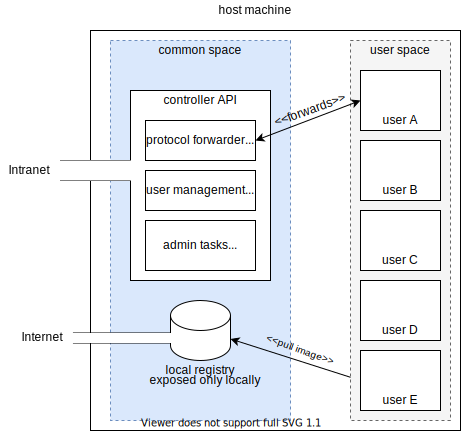

# Design draft for shared docker instance

## Specs

The following draft suggests an architecture and methods for setting up and maintaining a server that hosts docker containers for different users with different use cases. 

The main difficulty in such an environment is monitoring and managing images and volumes. More often than not, this is relegated to coordination between users which can lead to disastrous consequences (accidental removal of a volume/container in use, useless resources consumptions by orphaned containers). 

**Use cases**

- Centralized server for Machine Learning research applications (e.g. a group of different researchers using both `docker` and `nvidia-dockers` on the same machine)
- Infrastructure for teaching docker in university/enterprise context restricted to a single server.

**Requirements**

- Each user should have his own `namespace` : a separate, isolated environment unique to that user that should be able to be removed or archived (in case of employee departure) 
  - Images pulled from hubs should be shared across name if possible to reduce duplicate and memory consumption. 
  - Built images should be namespace specific. If not possible, it should at least be labelled with the author's name/specific id.  
  - Users should not be able to access other users namespaces (running 
  container and volumes)

- Admin namespaces:
  - should have visibility over all namespaces
  - should be able to see memory/cpu consumptions sorted
  - should be able to archive/remove namespaces

- Least amount of overhead possible (thus eliminating greedy solutions such as `openstack`). This is mandatory for academic contexts with limited resources.

---
# Proposal 1

Leverage bash aliases and UNIX usergroups to automatically add labels to corresponding docker commands. This solution is not at all secure and is solely dependant of the  `docker/nvidia-docker` cli but meets all the previous requirements whilst having no overhead.

Issues:
- No actual separation/isolation between users
- No way of using bash aliases to include `--label` with accurate position. It would otherwise require a forked version of `docker/cli` which implements that feature.
- The label adding will be relegated to the user. To address this issue and enforce the label rules, all non author labelled container will be removed automatically.

## Labelling process

Every image, volume, network and containers must be labelled according to the following scheme:

- `author: <email/name of the author>`
- `org: <organisation>` (only if shared between different organisations)

cleaning process (`src/prune.sh`):
- `crontab @daily docker system prune --filter='author...' --force` 
- `crontab @daily docker system prune --filter='until...' --force` 

## Archival process 

The archival directory should be hosted on a different / cloud server preferably: 

`docker save {{ container }} > {{ archive_dir }}/{{ org }}_{{ author }}_{{ container_name }}`

---
# Proposal 2

Each user has his own Docker-in-Docker which mounts the host `/var/lib/docker` to share the image storage load. This is sadly not possible due to the fact that the Docker daemon was explicitly designed to have exclusive access.

Another possibility is to run an instance of local docker registry and configure the `docker.json` file so that it becomes the default registry. This reduces image download latency and creates a *cache* for other users. However, if an user runs `docker pull <image>`, that image will still be cloned into their container's fs. 

This registry should propose a couple base images, with a combination of different installed utilities:
- `docker`
- `python2`
- `python3`
- `jupyter-notebook`
- `nvidia-docker`
- `nvidia-docker-2`
- machine learning "kits": `matplotlib`, `numpy`, `pandas`, `tensorflow`, `keras`, `pytorch`, ...

A simple server application should be required in order to:
- manage user spaces: 
  - provide LDAP (maybe call intranet LDAP if required) 
  - link an user with his/her user space(s)
  - remove spaces
  - archive spaces (by saving the docker image and sending it to another machine for storage preferably)
  - snapshot user spaces (if changes occured) and allow rollbacks
- forward a subset of ports to corresponding user spaces
- administrative tasks (automatic cleanup)

This is functionally identical to a group of applications that are already on the market (although using virtual machines rather than docker), namely:

- proxmox (simpler to setup)
- oVirt (open-source)
- RHEL (redhat backed)
- openstack (overkill solution which is destined for multi machine usage)$
- xenserver

